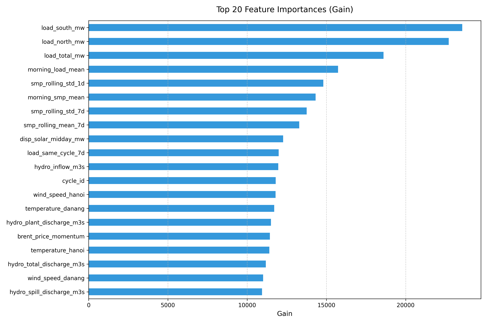
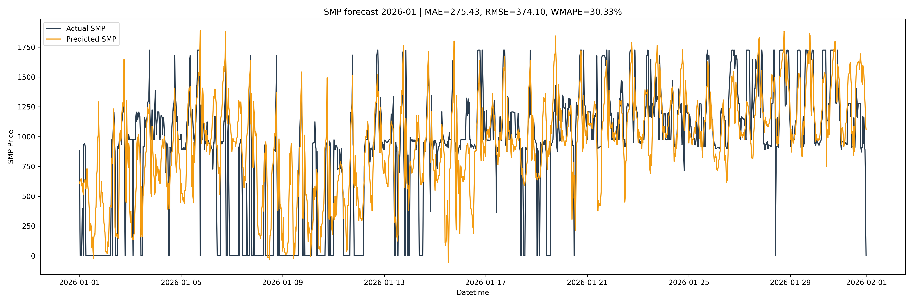
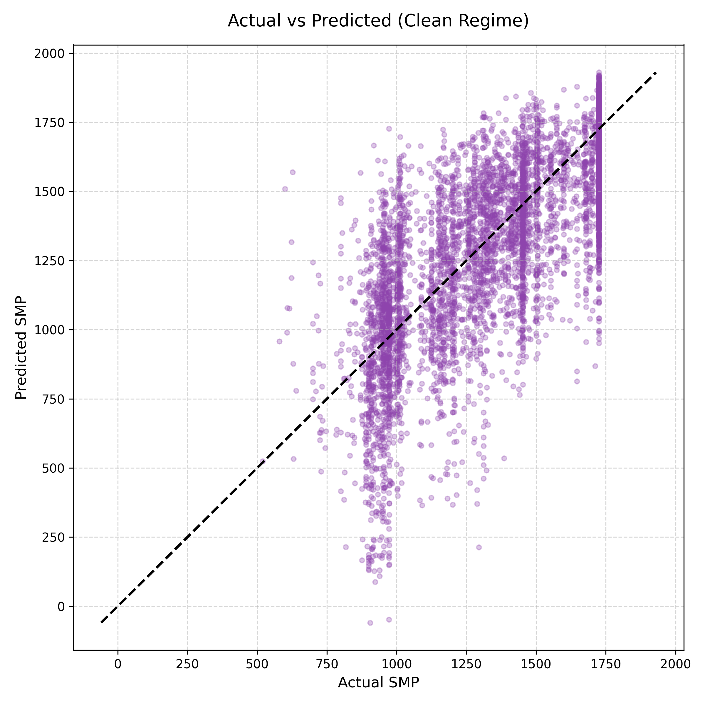
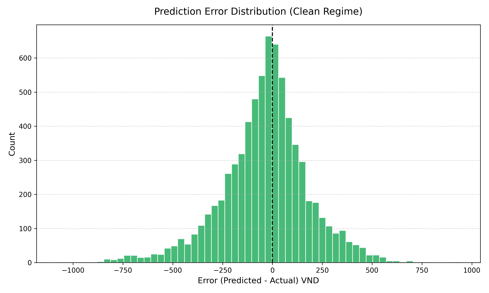
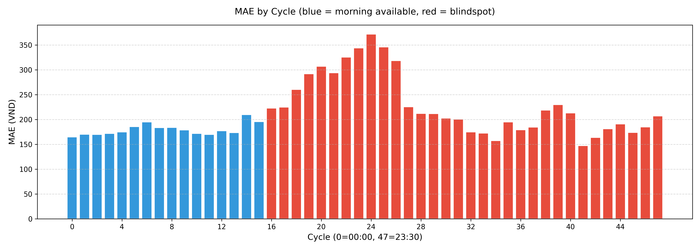

# Smp day-ahead price forecasting

Predicting Vietnam's competitive generation market (VCGM) system marginal price 48 cycles ahead under operational blindspot constraints.

## Overview

This project explores and compares day-ahead forecasting architectures for electricity spot prices (SMP) in Vietnam's wholesale power market. The core challenge is that all 48 half-hourly predictions for day D+1 must be submitted before 08:00 on day D, using only market data observed up to 07:30 that morning.

The research compares two distinct paradigms: a fast, adaptive single-model approach with online calibration, and a heavy stacking ensemble combining gradient boosted trees, daily profile models, and a regime-switching expert to handle the highly volatile, bimodal price distribution (normal vs collapse regimes).

## Problem description

The Vietnam system operator (A0/NSMO) requires market participants to submit price forecasts covering all 48 thirty-minute trading intervals of the next day. The submission deadline is 08:00-08:15 on day D.

This creates an information asymmetry referred to as the "08:00 blindspot":
- For D+1 cycles 00:00-07:30 (cycles 0-15), the corresponding cycle on day D has already occurred, so a 1-day lag is available
- For D+1 cycles 08:00-23:30 (cycles 16-47), the corresponding cycle on day D has not occurred yet, requiring a 2-day lag

Every feature in the pipeline must respect this constraint. Using any observation after 07:30 on day D for predicting day D+1 constitutes data leakage.

## Data

The system ingests data from three domains, covering 2021-01-01 to 2026-06-19 at 30-minute resolution:

| domain | source | variables |
|--------|--------|-----------|
| market | NSMO (private scraped dataset) | SMP prices (system, north, central, south), load by region, dispatch capacities |
| hydro | reservoir reports | inflow, discharge, water level for Hoa Binh, Son La, Ialy |
| exogenous | Open-Meteo, Yahoo Finance | temperature, radiation, wind speed across 3 regions; coal, gas, brent prices |
| calendar | manual | Vietnam public holidays including lunar dates (tet, hung king memorial) |

## Methodology

### Feature engineering

All features are strictly blindspot-safe. The pipeline produces roughly 200 features organized into several groups:

- **Same-cycle lags** at 1d, 2d, 3d, 7d, 14d, 28d offsets with the blindspot switch at cycle 15
- **Morning aggregates** from the 00:00-07:30 window of day D (mean, std, min, max, trend, gate probability)
- **Full-day aggregates** from the most recent complete day D-1
- **Weather proxies** for solar and wind generation using installed capacity and forecast radiation or wind speed
- **Derived signals** such as residual load, thermal margin, load-to-radiation ratio, load-to-wind ratio
- **Rolling statistics** including 1d and 7d volatility, 28d median, 28d quantiles (q90, q98), gate rates
- **fuel prices** with safe D-1 lags and 7d rolling averages for coal, gas, brent oil
- **hydro proxy** using 30-day rolling precipitation as a stand-in for reservoir levels
- **regime indicators** including a post-covid structural break flag, weekend and holiday features, holiday-load interaction



### Model architecture

The system uses a two-stage stacking ensemble.

**Stage 1 base learners**:
- LightGBM with MAE objective, 3000 estimators, 255 leaves
- XGBoost with absolute error loss, depth 10, GPU accelerated
- CatBoost with MAE loss, depth 10, GPU accelerated
- CING-LEAR multi-output group-sparse linear model operating on daily profiles
- Similar day expert using distance-weighted k-nearest-neighbor on daily feature vectors
- Regime forecaster with a collapse classifier and separate regressors for normal and low-price regimes

**Stage 2 meta-learner**:
- RidgeCV fitted on chronological out-of-fold predictions from stage 1
- Automatic base model selection across candidate subsets (trees only, trees + cing, trees + similar)
- Per-cycle bias correction using validation residuals

**Post-processing**:
- Collapse gate blending normal and low-price predictions weighted by collapse probability
- Shape guard enforcing physically plausible cycle-to-cycle price transitions
- State projection clipping predictions to historical bounds in the normal regime

### Validation strategy

The pipeline uses a two-tier validation approach:

1. **Pretest** runs walk-forward evaluation on 2024-2025 data to select the best model configuration and postprocessing parameters
2. **Final test** performs a one-time evaluation on 2026 data that was never seen during any selection or tuning

The pretest evaluates multiple calibration windows (45d to 1460d), online component averaging, and various bias and cap configurations. The winning configuration is selected by worst-case target ratio across all pretest years.

## Results

Best configuration on the 2026 test set:

| metric | value |
|--------|-------|
| WMAPE (clean, 500 < price < 2500) | 11.33% |
| MAE (clean) | 160.69 VND |
| RMSE (clean) | 219.66 VND |
| overall MAE | 212.75 VND |
| overall RMSE | 322.60 VND |
| valid samples | 7296 / 8160 (89.4%) |



Clean metrics exclude collapse events (price <= 500) and extreme spikes (price >= 2500) which represent market regime shifts rather than normal price dynamics.

### Error Analysis & Model Behavior

The stacking ensemble was designed to explicitly handle the bimodal nature of the VCGM price distribution.




*Residual error distribution demonstrating unbiased predictions with mean-zero centering in the normal regime.*

## Experiments & Model Comparison

During development, two distinct modeling paradigms were evaluated:

1. **Heavy Stacking Ensemble (Production choice)**
   - **Approach:** 4 base learners (LGBM, XGBoost, CatBoost, ICEEMDAN) grouped via Ridge Regression, 106 strictly pruned features.
   - **Training Time:** ~3.6 hours (220 minutes).
   - **Performance:** 11.33% Clean WMAPE, 212.75 VND Overall MAE.
   - **Verdict:** Sacrifices a small amount of accuracy in the normal price band but is highly robust against market regime collapses, reducing overall error significantly.

2. **Adaptive Window Single Model**
   - **Approach:** A single LightGBM model trained on a dynamic window (e.g., 1460 days), 310 features, with online calibration (`b14|c28|r0.98`) to dynamically correct bias.
   - **Training Time:** ~21 minutes.
   - **Performance:** 10.78% Clean WMAPE, 248.05 VND Overall MAE.
   - **Verdict:** Much faster to train and sharper in the normal price band, but the high feature count causes overfitting to outlier noise, making it struggle during severe market collapses.

## Strengths

- **Strict blindspot enforcement** -- the feature policy module programmatically blocks any column that would not be available at 08:00 on day D. unit tests verify that modifying data after the origin cutoff does not affect target-day features.
- **Regime-aware architecture** -- the collapse gate handles the bimodal price distribution without distorting normal-regime predictions. the system explicitly detects low-price events rather than treating them as noise.
- **Ensemble diversity** -- combining tree-based models with linear daily-profile experts and distance-weighted retrievals reduces variance across different market conditions.
- **Reproducible validation** -- the pretest framework runs hundreds of configuration combinations and selects based on worst-case target ratio, preventing overfitting to a single evaluation year.
- **Production-ready inference** -- the day-ahead script handles gap-filling, weather API calls, and online bias adjustment in a single pipeline.

## Weaknesses

- **No access to A0 load forecast** -- the single biggest limitation is that the system operator's official day-ahead load forecast is not available as input. load is proxied via lagged values which introduces systematic error during demand transitions such as heatwaves or holiday returns.
- **Collapse prediction is still noisy** -- while the regime expert detects price collapses better than ignoring them, precision remains low. false collapse predictions temporarily suppress prices that should remain in the normal range.
- **WMAPE still above 10%** -- the target of sub-10% clean WMAPE has not been achieved. the remaining error is concentrated in the afternoon blindspot cycles (16-35) where the 2-day lag is less informative.


- **Fuel price signal is weak** -- despite adding coal, gas, and brent data, the daily granularity of commodity prices limits their predictive contribution compared to half-hourly market features.
- **Training cost is high** -- the full stacking pipeline with 3000-estimator tree models and GPU acceleration requires about 50 minutes on a T4 GPU. pretest validation across all configurations takes several hours.
- **No deep learning benefit** -- attempts to integrate MLP and N-BEATS neural architectures degraded performance. the autoregressive feature space favors tree-based models, but this may change with richer input signals such as order book data.

## Project structure

```
├── src/
│   ├── data_preprocessing.py    # data loading and alignment
│   ├── feature_engineering.py   # blindspot-safe feature pipeline
│   ├── feature_policy.py        # production feature guardrails
│   ├── model_utils.py           # stacking ensemble training
│   ├── daily_models.py          # CING-LEAR and similar day experts
│   ├── regime_models.py         # collapse detection and regime forecasting
│   ├── iceemdan_utils.py        # signal decomposition module
│   ├── online_calibration.py    # bias and cap post-processing
│   ├── research_validation.py   # pretest framework and adaptive ensemble
│   └── evaluation.py            # metrics computation and visualization
├── tests/
│   ├── test_feature_contract.py      # blindspot safety verification
│   └── test_online_calibration.py    # online adjustment tests
├── train_model.ipynb            # kaggle training notebook
├── inference_production.py      # day-ahead production forecast
├── requirements.txt
└── outputs/kaggle_runs/         # evaluation plots and metrics
```

## Usage

### Training (kaggle)

Upload the dataset to kaggle and run `train_model.ipynb`. The notebook clones this repository, runs pretest validation on 2024-2025, trains the selected model on all pre-2026 data, and saves evaluation artifacts.

### Local inference

> [!NOTE]
> Due to GitHub's 100MB file size limit, the heavy Stacking Ensemble model (247MB) is hosted privately on Hugging Face. The repository includes the lightweight Adaptive Window model (29MB) by default for rapid inference testing.

```bash
pip install -r requirements.txt
python inference_production.py
```

This loads the trained model from `models/adaptive_window.pkl`, fetches today's data through the preprocessing pipeline, and prints the 48-cycle SMP forecast for tomorrow.

## Requirements

- Python >= 3.10
- Lightgbm >= 4.0
- Xgboost >= 2.0 (GPU optional)
- Catboost >= 1.2 (GPU optional)
- Scikit-learn >= 1.3
- Pandas >= 2.0
- Numpy >= 1.24
- Matplotlib >= 3.7
